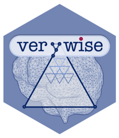

```{r, include = FALSE}
knitr::opts_chunk$set(
  collapse = TRUE,
  comment = "#>",
  fig.path = "man/figures/README-",
  out.width = "100%"
)
```

# **`verywise`** <a href="https://seredef.github.io/verywise/"></a>
### vertex-wise, whole-brain linear mixed models

<!-- badges: start -->
[](https://lifecycle.r-lib.org/articles/stages.html#experimental)
<!-- badges: end -->

The goal of `verywise` is to offer a flexible, user-friendly interface to whole-brain analysis of neuro-imaging data that has been pre-processed using [FreeSurfer](https://surfer.nmr.mgh.harvard.edu/). 

The package was specifically designed for the analysis of *longitudinal* (e.g. multi-session) and/or *multi-site* neuroimaging data. 

Currently, `verywise` allows the estimation of vertex-wise **Linear Mixed Models**, but will be extended to other statistical models in the future.

It can handle imputed (phenotype) data from several packages (`mice`, `mi`, `amelia`, etc.).

Multiple testing correction is currently achieved using MCZ simulations from FreeSurfer.
This means that you will need FreeSurfer installed and correctly set up.


## Installation

You can install the development version of `verywise` from [GitHub](https://github.com/) with:

``` {r install, eval = FALSE}
# install.packages("devtools")
devtools::install_github("SereDef/verywise")
```

## Basic use

```{r load, eval = FALSE}
library(verywise)
```

```{r lmm, eval = FALSE}
# Run a linear mixed model
run_vw_lmm(
  formula = vw_thickness ~ sex * age + site + (1 | id), # model formula
  subj_dir = "./VeryWiseUserUser/SimulatedExample", # Neuro-imaging data location
  hemi = "both", # (default) which hemispheres to run
  pheno = phenotype, # An R object already in memory or path to file 
)

```

You can find more info and tutorials [here](https://seredef.github.io/verywise/index.html).

## Visualization 

To inspect and plot your results you can use our interactive web application, [verywiseWIZard](https://github.com/SereDef/verywise-wizard). You can run this locally or try it out [here](https://seredef-verywise-wizard.share.connect.posit.cloud/).

## Note

This is a spin-off of the (more stable) [`QDECR`](https://www.qdecr.com/) package.

## Funders  


This work was supported by the *FLAG-ERA* grant [**Infant2Adult**](https://www.infant2adult.com/home) and by The Netherlands Organization for Health Research and Development (ZonMw, grant number 16080606). 

All feedback and contributions are **very welcome!**.
