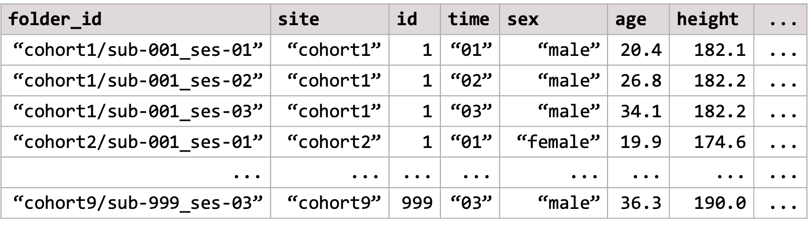

# Get ready - step 2: preparing your data

The `verywise` package was specifically developed to handle **complex
datasets**, with *multiple cohorts/sites/scanners* as well as *repeated
neuro-imaging measures*. In order to run such bussin analyses however,
you will need to prepare two data inputs:

1.  The brain surface files (i.e. Freesurfer output files)
2.  The phenotype data: a dataset containing exposures, covariates,
    identifiers, etc.

In this article we describe how the software expects the input data
directory to look like, and what pre-processing steps are necessary to
get both your **neuro-imaging** data and your **phenotype** data ready
for analysis.

## Overview: a `verywise` input directory structure

Here is an example of a typical `verywise` input directory:


This is also what you will see if you use our data simulation functions
(see tutorial
[here](https://seredef.github.io/verywise/articles/02-simulate-data.md)).
*Note*: the phenotype file does not *need* to be inside the same folder
as the neuroimaging data, but we placed it in there to keep things tidy.

If you have more than one neuroimaging “site” (or “cohort” or dataset,
however you want to call it), then **each site should have it’s own
folder**. Inside each site folder you should have one sub-folder for
each individual measurement (or “session”). These sub-folders should
follow the [BIDS convention](https://bids.neuroimaging.io/), so for
example: `sub-47_ses-03` will have the 3rd measurement of subject \#47.
Inside each sub-folder `verywise` expects to find (at a minimum) a
“surf” directory, where the FreeSurfer output for that subject-session
is stored.

If you have run FreeSurfer correctly (see next section), this should be
already all set up for you.

## Preparing your brain data

To obtain the brain surface data, you should first run your structural
MRI data files through FreeSurfer’s cortical reconstruction process. In
a nutshell, this can be done using the command:

``` sh
recon-all -s <subject-id> -qcache
```

Which should take about 10 minutes per subject. Don’t forget the
`-qcache` flag!

Full instructions can be found
[here](https://surfer.nmr.mgh.harvard.edu/fswiki/recon-all). See also
this very useful
[tutorial](https://andysbrainbook.readthedocs.io/en/latest/FreeSurfer/FS_ShortCourse/FS_03_ReconAll.html).

The `recon-all` pipeline essentially transforms your “3D” T1-weighted
MRI volumes into *2D* **surface models** made up of vertices and mapped
onto a specific *template* (usually, `fsaverage`). At each vertex on
this surface a number of “local” anatomical **metrics** are also
calculated. These measures typically include: cortical thickness,
surface area, curvature, sulcal depth / convexity, volume and
gyrification index.

The output folder should now look similar to the one you have seen
above. Inside each subject-session sub-folder you should be able to find
a “surf” directory where these brain surface maps are saved as `.mgh`
files (for each hemisphere and measure separately).

These are the files we will be using for our analysis.

## Preparing your phenotype data

So the brain surface data is (pretty much all) sorted by running
FreeSurfer, but you will also need to prepare a “phenotype” dataset
where to store any other variable of interest (i.e. the exposures and
covariates).

In `verywise`, we expect the phenotype data to be some kind of tabular
data structure (e.g. a `data.frame`, a `tibble` or a multiple imputation
dataset) where each row corresponds to a specific observation (aka, a
subject-session measurement), and each column corresponds to a variable
(e.g. age, sex, site, diagnosis, etc.).

The phenotype data can be either stored in a file (supported file types:
`.rds`, `.csv`, `.sav`, `.txt`), or it can be an object loaded in
memory.

Either way, it should it should look something like this:



Some important characteristics of the phenotype data that we need to
point out, so we can remain friends:

### Long format data

The phenotype data should be in the *“long format”* with different
timepoints/sites/groups stacked row-wise. Each row in the data should
correspond to a single data point, or a specific observation (for
example, a subject-session measurement). This is a typical structure
used for longitudinal data analysis.

If necessary, you can convert your data from “wide” to long format using
a variety of functions. E.g. the `tidyr` package offers
[`pivot_longer()`](https://tidyr.tidyverse.org/reference/pivot_longer.html),
though I tend to prefer
[`stats::reshape()`](https://www.rdocumentation.org/packages/stats/versions/3.6.2/topics/reshape).

### Essential columns and naming conventions

The phenotype data content will vary, of course, depending on what
variables are of interest / needed in your analysis.

The only requirement is that the phenotype must always include a
**folder ID** column (by default, this is expected to be called
`folder_id`). This column is important because it speficies link between
the phenotype data to the (correct) brain surface data file. It should
contain the *relative path* to the subject-session sub-folders inside
your neuroimaging data directory (or `subj_dir`).

For example, if your repeated measurement analysis includes only one
site, the `folder_id` column could look like
`"sub-001_ses-baseline", "sub-001_ses-F1", "sub-002_ses-baseline"...`.

If multiple sites are included, and they are all stored inside the same
main `subj_dir` folder, then the `folder_id` column could look like
`"site1/sub-001_ses-baseline", "site1/sub-001_ses-F1", "site2/sub-001_ses-baseline"...`.

This principle also generalies to messier data folder structures (though
they are not recommended, for obvious reasons):
e.g. `"path/to/site1/sub-001_ses-baseline", "path/to/site1/sub-001_ses-F1", "other_/path/to/site2/sub-001_ses-baseline"...`

Note that no duplicates or missing values are allowed in the `folder_id`
column.

### Multiple imputation support

Now something fairly dope: the phenotype data object can also be an
**imputed dataset**.

`verywise` supports several of the most common multiple imputation data
formats in R, including the outputs of `mice`, `mi`, `Amelia`, and
`missForest`. This can also simply be a *list of data.frames*, where
each data.frame corresponds to a single imputed dataset.

Note that each dataset in the set must have identical dimentions, and
contain all the required columns (including the `folder_id`).

When using imputed data, `verywise` will automatically run the
vertex-wise analysis on each imputed dataset separately, and then pool
the results together using Rubin’s rules.

## 

Optional read: [Simulate data for
`verywise`](https://seredef.github.io/verywise/articles/02-simulate-data.md)

Next article: [Run a vertex-wise linear mixed
model](https://seredef.github.io/verywise/articles/03-run-vw-lmm.md)
