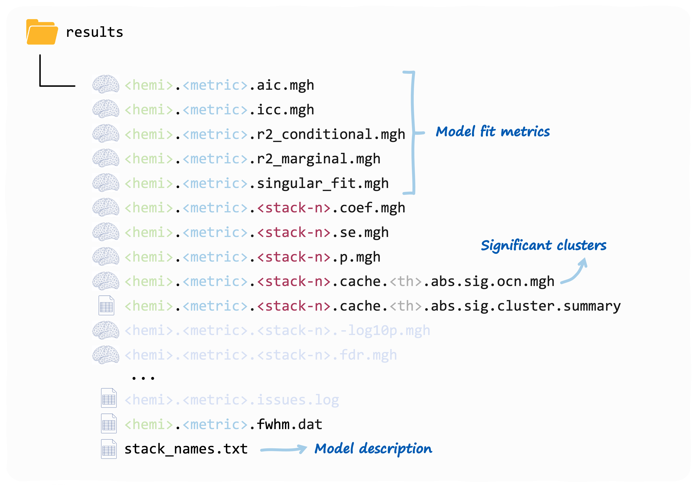

# Running vertex-wise linear mixed models

> **Warning**  
> `verywise` lets you run vertex-wise analyses however you want to. For
> example, you can add interactions and splines / polynomials to your
> models, as many random intercept and slopes as your heart desires…,
> you can use liberal thresholds and test as many hypothesis as you have
> time for. Remember: this software is just a tool, and it is up to you
> to use it sensibly.

With your set-up and data ready, it is finally time to use some
`verywise` functionality.

In this article we’ll cover **linear mixed models**, but first, you’ll
need to load the package into your R session:

``` r

library(verywise)
```

## *Wait, what is a linear mixed model again?*

A linear mixed model (LMM) is a **multilevel regression** technique,
that is especially useful when observations are *clustered* (e.g. across
neuroimaging sites) or *repeated* (across time).

In a nutshell, a LMM includes both ***fixed effects*** (parameters
associated with the entire population) and ***random effects***
(parameters that vary across groups, such as subjects or sites).

Later in this tutorial, a few important considerations for building and
interpreting LMMs are highlighted. If you want to learn more about the
theory behind this technique, check out the resources at the end of this
article.

## Run a vertex-wise linear mixed model

One of the core functions in the `verywise` package is `run_vw_lmm`
which fits a linear mixed model to each vertex on the brain surface.

> Note: `run_vw_lmm` has a small brother `run_voxw_lmm` for running the
> same model to an arbitrary matrix of datapoints (e.g. voxel data)

Let’s demonstrate a simple (and probably most common) example of a mixed
model, in which a single grouping factor (participants) is modelled as a
random intercept:

``` r

# Run a vertex-wise linear mixed model
run_vw_lmm(
  formula = vw_thickness ~ sex * age + site + (1 | id), # model formula
  pheno = "path/to/phenotype/data.rds",                 # or an R object already in memory
  subj_dir = "/path/to/freesurfer/subjects",            # Pre-processed brain data location
  outp_dir = "/path/to/output",                         # Where you want to store results
  hemi = "lh",                                          # (default) or "rh": which hemisphere
  n_cores = 4                                           # number of cores for parallel processing
)
```

The function first validates all inputs, then runs
[`lme4::lmer`](https://rdrr.io/pkg/lme4/man/lmer.html) on every vertex
in the selected hemisphere. Results are written to `outp_dir` (see
[Output structure](#output-structure)).

The key parameters are described in the following sections.

### Main arguments

##### `formula`

A model formula object. Use this to specify the LMM you wish to run,
using [`lme4`
syntax](https://cran.r-project.org/web/packages/lme4/vignettes/lmer.pdf),
for example: `vw_area ~ sex * age + site + (1 | id/site)`. See the next
section for some advice, cheatsheets and references on model
specification.

The **outcome** variable must be one of the supported brain surface
metrics computed by FreeSurfer, prefixed by `vw_`:

| Metric              | Description                             |
|---------------------|-----------------------------------------|
| `vw_thickness`      | Cortical thickness                      |
| `vw_area`           | Cortical surface area (white surface)   |
| `vw_area.pial`      | Cortical surface area (pial surface)    |
| `vw_curv`           | Mean curvature                          |
| `vw_jacobian_white` | Jacobian determinant (white surface)    |
| `vw_pial`           | Pial surface coordinates                |
| `vw_pial_lgi`       | Local gyrification index (pial surface) |
| `vw_sulc`           | Sulcal depth                            |
| `vw_volume`         | Gray matter volume                      |
| `vw_w_g.pct`        | White/gray matter intensity ratio       |
| `vw_white.H`        | Mean curvature (white surface)          |
| `vw_white.K`        | Gaussian curvature (white surface)      |

It is currently only possible to have brain metrics as outcome
variables.

##### `pheno`

The phenotype data. This is either:

- an R **object** already loaded in your environment (pass the object
  name directly), or
- a string containing the **path** to a data file, that will then be
  read into memory for you. Supported file extensions: `rds`, `csv`,
  `txt` and `sav`.

Both **single datasets** (e.g. a `data.frame`) and **multiply imputed
datasets** (i.e. a `mids` object or a list of data frames) are
supported. Either way, the data must be in **long format** and it must
contain all variables in `formula` plus a `folder_id` column (see
below).

More details on format requirements can be found in the [Data format
article](https://seredef.github.io/verywise/articles/01-format-data.md).
For information on how multiple imputation results are pooled, see
below.

##### `subj_dir`

The path to the FreeSurfer data directory. This must follow the
`verywise` directory structure (see [Data format
article](https://seredef.github.io/verywise/articles/01-format-data.md)
for details).

##### `hemi`

Hemisphere to analyse. Options: `"lh"` (left hemisphere; default) or
`"rh"` (right hemisphere). For whole-brain analysis, you should run the
function twice (See the [next
article](https://seredef.github.io/verywise/articles/04-run-slurm-array.md)
for reasons and tips to automate this process.

### Other arguments

These arguments are all optional, but you may want to tweak them
depending on your analysis:

- **`outp_dir`**: the path to the output directory, where results will
  be stored. If `NULL` (default), the function creates a
  “verywise_results” sub-directory in the current working directory (not
  recommended for tidiness reasons).

- **`fs_template`**: which FreeSurfer template to use for vertex
  registration. Options:

  - `"fsaverage"` (default) = 163842 vertices (highest resolution and
    default),
  - `"fsaverage6"` (default) = 40962 vertices,
  - `"fsaverage5"` (default) = 10242 vertices,
  - `"fsaverage4"` (default) = 2562 vertices,
  - `"fsaverage3"` (default) = 642 vertices

Lower resolutions are useful for testing model specifications because
they cut computation time. `verywise` will downsample into lower
resolutions for you, however we recommend running the final analyses run
using the template that the data was registered to. Also note that
FreeSurfer cluster correction requires template specific simulation
files.

- **`folder_id`**: Name of the column in `pheno` that contains subject
  directory names for the input neuroimaging data
  (e.g. `"sub-001_ses-baseline"` or `"site1/sub-010_ses-F1"`). These are
  expected to be nested inside `subj_dir`. Default: `"folder_id"`.

- **`n_cores`**: Number of CPU cores for parallel processing. Default:
  `1`. The value you provide will be checked against the number of
  available CPU cores on your machine.

- **`weights`**: A string (column name in `pheno`) or numeric vector of
  model weights (e.g. inverse-probability weights). Note that weights
  are not normalized or standardized in any way. If a vector, its length
  must match the number of rows in the data. Default: `NULL`.

- **`seed`**: Random seed for reproducibility. Default: `3108`.

- **`save_ss`**: Whether to save the super-subject matrix as an `.rds`
  file for reuse in future analyses. Can also be a path string. When
  `TRUE`, saved to `<outp_dir>/ss`. Default: `FALSE`.

### Even more arguments (fine-grained control)

These are more advanced arguments that you typically won’t need, but you
may want to tweak depending on your analytical (and control) needs:

- **`apply_cortical_mask`**: Whether to exclude non-cortical vertices.
  Default: `TRUE` (recommended).

- **`tolerate_surf_not_found`**: Maximum number of missing or corrupted
  surface files tolerated before execution stops. Default: `20`.

- **`lmm_control`**: A list of control parameters passed to
  [`lme4::lmer()`](https://rdrr.io/pkg/lme4/man/lmer.html)
  (e.g. optimizer choice, convergence criteria). Must result from
  `lmerControl()`. Default: uses `lme4` defaults.

- **`REML`**: Whether to use Restricted Maximum Likelihood for fitting
  the linear mixed model. Default: `TRUE`.

- **`chunk_size`**: Number of vertices processed per chunk in parallel
  operations. Larger values use more memory but may be faster. Default:
  `1000`.

- **`FS_HOME`**: Path to the FreeSurfer home directory. Defaults to the
  `$FREESURFER_HOME` environment variable if set during installation
  (see [Set-up
  article](https://seredef.github.io/verywise/articles/00-installation-sys-requirements.md)).

- **`fwhm`**: Full-width half-maximum for the smoothing kernel. Default:
  `10`.

- **`mcz_thr`**: Monte Carlo simulation threshold. Accepted values
  (equivalent forms separated by `/`):

  - `13 / 1.3 / 0.05`
  - `20 / 2.0 / 0.01`
  - `23 / 2.3 / 0.005`
  - `30 / 3.0 / 0.001` (default)
  - `33 / 3.3 / 0.0005`
  - `40 / 4.0 / 0.0001`

- **`cwp_thr`**: Cluster-wise p-value threshold. Set to `0.025` by
  default (i.e. accounting for two hemispheres). Adjust this according
  to the number of analyses you are running.

- **`save_optional_cluster_info`**: Whether to save additional output
  from the `mri_surfcluster` call. Default: `FALSE`.

- **`save_residuals`**: Whether to save a `residuals.mgh` file. Default:
  `FALSE` (recommended, as these files can be large).

- **`verbose`**: Whether to display progress messages. Default: `TRUE`.

## A little more theory: constructing the right model

Model specification is probably the most important step when running a
LMM (or any model really). A poorly specified model can lead to biased
estimates, incorrect inferences, and misleading conclusions. And… since
you are fitting hundreds of thousands of models (one per vertex),
getting this right from the start (and ideally consistently across the
brain), will save you a good deal of time.

### Is my variable a fixed or a random effect?

In many cases, the same variables could be considered either a random or
a fixed effect (and sometimes even both at the same time, though I
wouldn’t get too excited about that). The difference between these two
modeling choices has little to do with the variables themselves, and a
lot more to do with your study design / research question.

In broad terms, *fixed effects* are variables you are interested in, you
want to know about their association with the brain metric of choice.
Random effects are *grouping factors* (i.e. categorical variables) that
you are not specifically interested in, but you know are likely to
influence such brain measures (e.g. scanner, site, subject ID).

> *Note*
>
> : Random effects may *not* be appropriate when the number of factor
> levels is very low (a commonly reported rule of thumb is \< 5), or
> when you would not assume that your factor levels come from a common
> distribution (e.g. treating male and female as two draws from an
> infinite population of sexes, which has a mean that makes a sense).
> Read more about this topic [here](https://peerj.com/articles/12794/),
> [here](https://bookdown.org/steve_midway/DAR/random-effects.html), and
> [here](https://bbolker.github.io/mixedmodels-misc/glmmFAQ.html#should-i-treat-factor-xxx-as-fixed-or-random).

### Random structure specification

The clustering patterns that can be modeled using random effects can
take many forms. The `lme4` formula syntax is very flexible. Almost
\*too flexible\*\*, so it can be tricky to get your head around all the
available options. Here is a quick cheatsheet adapted ( / stolen) from
StackOverflow (RIP):

| **formula** | **meaning** |
|----|----|
| `(1 | group)` | random group intercept |
| `(x | group)` = `(1 + x | group)` | random slope of `x` within group - with correlated intercept |
| `(0 + x | group)` | random slope of `x` within group - no variation in intercept |
| `(1 | group) + (0 + x | group)` | *uncorrelated* random intercept and random slope within group |
| `(1 | site/id)` = `(1 | site) + (1 | site:id)` | intercept varying among sites and among people within sites (*nested random effects*) |
| `site + (1 | site:id)` | fixed effect of sites plus random variation in intercept among people within sites |
| `(x | site/id)` = `(x | site) + (x | site:id)` | slope and intercept varying among sites and among people within sites |
| `(x1 | site) + (x2 | id)` | two different effects, varying at different levels |
| `(1 | group1) + (1 | group2)` | intercept varying among *crossed random effects* (e.g. site, year) |

#### Nested vs. crossed random effects

Clustering in longitudinal neuroimaging data is often *hierarchical*:
repeated brain observations are nested within individuals, individuals
are nested within sites, sites within cohorts, and so on. These can be
modelled as **nested random effects** (e.g. `(1 | site/id)`).

In other cases, there is no nesting structure. For example, if
participants complete multiple tasks (or questionnaires or image
acquisition protocol…) and observations are clustered both by individual
and by task type, this would be a **crossed random effects** structure:
one level of a random effect appears in combination with more than one
level of another (e.g. `(1 | id) + (1 | site)` in a design were people
move across sites).

Read more about nested vs. crossed designs
[here](https://www.muscardinus.be/statistics/nested.html) and
[here](https://bbolker.github.io/mixedmodels-misc/glmmFAQ.html#nested-or-crossed).

## `verywise` output

Once `run_vw_lmm` has done its thing, you should find a series of files
in your output directory, more or less looking like this:



Each fixed effect term you have included in the model, will get its set
of vertex-wise coefficients, SEs, p-values and (optionally) significant
clusters. The `stack_names.txt` file contains the mapping that you (and
`verywise`) an use to identify which stack corresponds to what term.

These are all `mgh` files that you can read using FreeSurfer or
`verywise` itself (with
**[`load.mgh()`](https://seredef.github.io/verywise/reference/load.mgh.md)**).

> Note: a “compressed version” of this output is on its way! If you
> would like something else to be outputted, let us know!

The model fit outputs are discussed more in detail in [this
article](https://seredef.github.io/verywise/articles/07-model-fit-comparison.md)

### A note on *P*-values

*P*-values for fixed effect in LMM are a tricky business. This is
because, in unbalanced or nested designs the effective degrees of
freedom for each parameter are not straightforward to compute
analytically. You can read more about this
[here](https://bbolker.github.io/mixedmodels-misc/glmmFAQ.html#why-doesnt-lme4-display-denominator-degrees-of-freedomp-values-what-other-options-do-i-have).

In `verywise` p-values are are calculated using the **t-as-z**
approximation (i.e. assuming a Gaussian distribution of observations
conditional on fixed and random effects). This approximation works well
for under certain conditions (i.e. large sample sizes, and balanced
designs with single or nested random effects only; see [Luke
(2017)](https://doi-org.eur.idm.oclc.org/10.3758/s13428-016-0809-y)).

Please note that more complex designs benefit from alternative
approximations (Satterthwaite, Kenward-Roger) that are not yet
implemented directly in `verywise` (but can be obtained using the
`pbkrtest` or `lmerTest` packages)

## Resources

More on linear mixed models:

- [Mixed Models with
  R](https://m-clark.github.io/mixed-models-with-R/introduction.html)
- [`lme4` model
  specification](http://www.rensenieuwenhuis.nl/r-sessions-16-multilevel-model-specification-lme4/)
- [`lme4` model specification
  (2)](https://rpsychologist.com/r-guide-longitudinal-lme-lmer)
- <https://ourcodingclub.github.io/tutorials/mixed-models/>
- <https://gkhajduk.github.io/2017-03-09-mixed-models/>
- <https://meghan.rbind.io/blog/2022-06-28-a-beginners-guide-to-mixed-effects-models/>

## 

Next article: [Run *many* vertex-wise linear mixed
models](https://seredef.github.io/verywise/articles/04-run-slurm-array.md)
