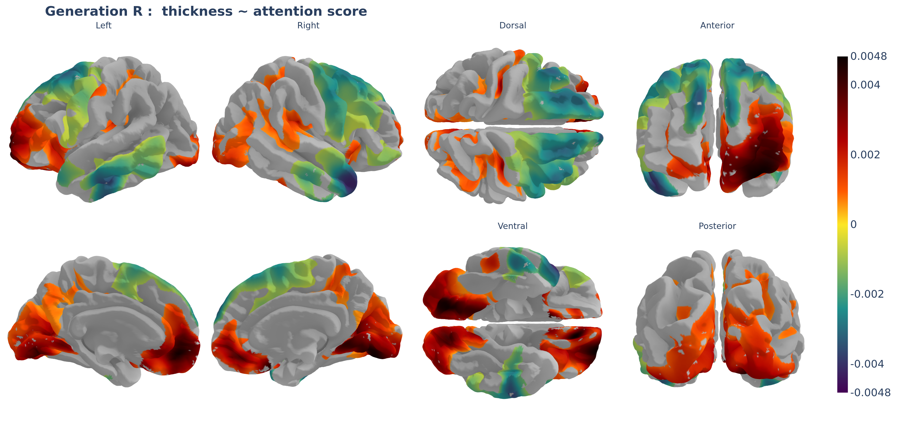

# Extracting and visualizing \`verywise\` results

All done with the analyses? That was a handful, you must be hungry for
some brain maps.

There are two main ways to inspect and visualize `verywise` results:

- directly in R, using `verywise` plotting and extraction functions
- in your browser, using the `verywiseWIZard` web application

## Visualizing results

### `verywiseWIZard`: interactive visualization app

To inspect and plot your results, you can use our interactive web
application,
[verywiseWIZard](https://github.com/SereDef/verywise-wizard). You can
run this locally or try it out
[here](https://seredef-verywise-wizard.share.connect.posit.cloud/).

Note: if you are using the online version of the WIZard, with results
hosted on GitHub, you may want to look into the
[`move_result_files()`](https://seredef.github.io/verywise/reference/move_result_files.md)
helper function, to organize your results in a way that is efficient to
upload and safe (i.e., does not expose individual level data) and quick.

### Plotting directly in `verywise`

If you are in no mood to move or upload results around, you can just
stay where you are and use generate plots directly from R using
`verywise`.

Note however that these plotting functions rely on Python-based surface
visualization under the hood, so you will need `reticulate` installed
and Python installed.

The main plotting helpers are:

- [`plot_vw_map()`](https://seredef.github.io/verywise/reference/plot_vw_map.md)
  for plotting (thresholded) beta/coefficient maps (more info below)
- [`plot_vw_diff()`](https://seredef.github.io/verywise/reference/plot_vw_diff.md)
  for plotting a difference between two brain surface maps. You can use
  this to check whether two terms have similar spatial mapping for
  example, or to compare the fit of two models (see the [model
  comparison
  article](https://seredef.github.io/verywise/articles/07-model-fit-comparison.md)).
- [`plot_vw_surf()`](https://seredef.github.io/verywise/reference/plot_vw_surf.md)
  a more flexible / customizable lower-level function, if you want more
  direct control over what gets plotted and how.

You can use these functions in R, but they are Python wrappers, so they
will require the `reticulate` package installed.

The most common function used is
[`plot_vw_map()`](https://seredef.github.io/verywise/reference/plot_vw_map.md).
It takes a `verywise` results directory, locates the coefficient map for
a term of interest, optionally applies a threshold, and renders the
result on a brain surface either interactively (HTML) or as a PNG.

``` r

plot_vw_map(
  res_dir = "/path/to/output",
  term = "age",
  measure = "area", 
  hemi = "both",                # (default) or "lh", "rh" for single hemisphere
  surface = "pial",             # or "inflated"
  threshold = "fdr<0.05",
  to_file = NULL,               # interactive visualization or static output
  # --- optional arguments ---
  title = "Effect of age on Surface Area",
  fs_template = "fsaverage",
  fs_home = "/path/to/FREESURFER_HOME", # uses local maps which is quicker than downloading and caching
  # outline_rois = c("entorhinal", "precuneus") # TODO: not yet available (coming!)
)
```

The `threshold` argument controls which parts of the beta map are shown.
Common choices include:

- **`"cws"`**: cluster-wise significant vertices (default), assuming
  cluster correction was computed during the analysis.
- **`"fdr<0.05"`**: an FDR-corrected significance level, assuming
  FDR-adjusted p-values were calculated at the analysis stage. Note, use
  whatever threshold you like (e.g. `"fdr<0.001"`), we’ll do the rest.
- **A numeric value**, e.g. `0.001`: interpreted as a raw coefficient
  (absolute) threshold

In practice, `"cws"` is often the most interpretable option for final
figures, while numeric thresholds can be useful during early
exploration.

When `to_file = NULL` (the default), `verywise` will open an interactive
3D brain visualization in the RStudio Viewer or in your default browser.
You can then play with this, rotate the brains, zoom in certain regions,
and when you hover over the map, get information about each vertex value
and the DK region it is in.

This can be saved as an HTML file, but often, for manuscripts, reports,
or slide decks, you may prefer a “static” image. In that case, provide a
file path to `to_file`, for <example:%60to_file> =
path/to/figures/age_area_cws.png\`

This produces a static image in which all views of the brain are visible
at once, which is usually easier to share and reproduce.



## Plotting on an HCP cluster

If you want to render plots directly on an HPC cluster (e.g. Snellius),
this is possible but you will need a working browser backend such as
Chrome or Chromium (kaleido default works well) and and a virtual
display such as `Xvfb`.

You will have to set up an Xvfb process **before** starting R (e.g. in
your job script or in the shell before launching R). For example, on
Snellius, I do:

``` sh
module load 2025
module load Xvfb/21.1.18-GCCcore-14.2.0

Xvfb :99 -screen 0 1280x1024x24 &
export DISPLAY=:99
sleep 1  # give Xvfb time to start
```

For troubleshooting, you can use the helper
[`plot_sitrep()`](https://seredef.github.io/verywise/reference/plot_sitrep.md).

## Extracting mean/median cluster values

Sometimes, you may want to extract the mean or the median value of a
specific cluster from your results, for example to use this in further
analysis. You can do this in `verywise` using the
[`significant_cluster_stats()`](https://seredef.github.io/verywise/reference/significant_cluster_stats.md)
function.

*Note*: ideally, you should run your analyses with `save_ss = TRUE` or
`save_ss = "path/to/ss"`, or you have called
[`build_supersubject()`](https://seredef.github.io/verywise/reference/build_supersubject.md)
in your pipeline, for this to sun smoothly.

``` r

# Extract mean from significant clusters
df <- significant_cluster_stats(stat = "mean", # or "median"
                                ss_dir = "path/to/ss_directory", 
                                res_dir = "path/to/results", 
                                term = "age", # term of interest 
                                measure = "thickness", 
                                hemi = "lh")
```

## 

Next article: [Run vertex-wise federated / meta-
analyses](https://seredef.github.io/verywise/articles/06-run-vw-meta-and-fed.md)
