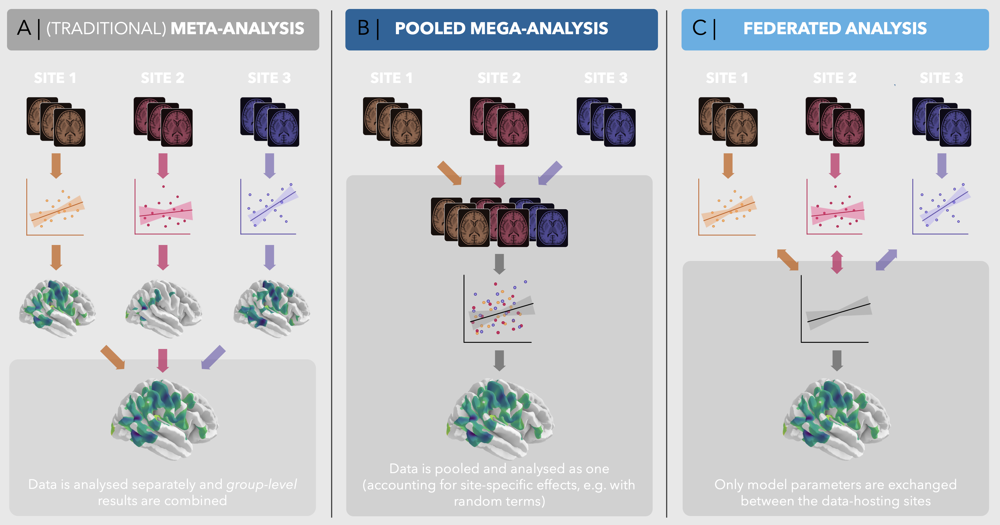

# **`verywise`**

### vertex-wise, whole-brain linear mixed models

The goal of `verywise` is to offer a flexible, user-friendly interface
to whole-brain analysis of neuro-imaging data that has been
pre-processed using [FreeSurfer](https://surfer.nmr.mgh.harvard.edu/).

The package was specifically designed for the analysis of *longitudinal*
(e.g. multi-session) and/or *multi-site* neuroimaging data.

Currently, `verywise` allows the estimation of vertex-wise **Linear
Mixed Models**, and **meta-analysis**, but will be extended to other
statistical models in the future.

It can handle imputed (phenotype) data from several packages (`mice`,
`mi`, `amelia`, etc.).

Multiple testing correction is currently achieved using MCZ simulations
from FreeSurfer. This means that you will need FreeSurfer installed and
correctly set up.

## Installation

You can install the development version of `verywise` from
[GitHub](https://github.com/) with:

``` r
# install.packages("pak")
pak::pak("SereDef/verywise")

# or 
# install.packages("devtools")
devtools::install_github("SereDef/verywise")
```

## Basic use

``` r
library(verywise)
```

There are many settings that benefit from the multilevel structure
implemented in `verywise`

### Run a linear mixed model (e.g. longitudinal analysis)

``` r
run_vw_lmm(
  formula = vw_thickness ~ sex * age + site + (1 | id), # model formula
  pheno = long_format_data, # An R object already in memory, or "path/to/phentype/data"
  subj_dir = "/path/to/freesurfer/subjects", # Neuro-imaging data location
  outp_dir = "/path/to/output", # Where you want to store results
  hemi = "lh", # (default) or "rh": which hemisphere to run
  n_cores = 4  # parallel processing
)
```



### Run a (traditional) meta-analysis

``` r
run_vw_meta(
  term = "age", # Which "term" / predictor / effect to pool
  hemi = "lh", # (default) or "rh": which hemisphere to run
  measure = "area", # (default) or any available FreeSurfer metric.
  res_dirs = c("/path/to/study1/results", "/path/to/study2/results"),
  study_names = c("Study1", "Study2"),
  n_cores = 4  # parallel processing
)
```

### Run a federated / distributed analysis

#### STEP 1: at each local site

``` r
s1_res = run_vw_fed_local( 
  site_name = "site1",
  formula = vw_area ~ sex + age,
  pheno = pheno_site1,
  subj_dir = "/path/to/site1/local/data",
  outp_dir = "/path/to/site1/partial/results",
  hemi = "lh",
  fs_template = "fsaverage", 
  n_cores = 1)

# [...] Run other models, e.g. rh, thickness... once done: 
compress_local("/path/to/site1/partial/results", "site1")

# Send the "site1.tar.gz" the the aggregating center
```

#### STEP 2: at the aggregating center

``` r
tot_res <- run_vw_fed_aggr(
  site_names = c('site1', 'site2', 'site3'),  
  formula = vw_area ~ sex + age,
  inpt_dir = "/path/to/tarred/partial/results",
  outp_dir = "/path/to/final/results",
  hemi = "lh",
  fs_template = "fsaverage"
  n_cores = 1)
```

Note: `verywise` implements a lossless algorithm (i.e. `tot_res`
identical to running the model on the entire dataset, as on
*mega-analysis*, but privacy preserving).

## Visualization

To inspect and plot your results, you can use our interactive web
application,
[verywiseWIZard](https://github.com/SereDef/verywise-wizard). You can
run this locally or try it out
[here](https://seredef-verywise-wizard.share.connect.posit.cloud/).

Plots can also be generated using `verywise` like so:

``` r
# Plot result brain map (requires FreeSurfer for templates and reticulate for interface with Python-based plotting libraries)
plot_vw_map(
  term = "age",
  hemi = "lh",
  measure = "area",
  res_dir = "/path/to/output",
  outline_rois = c("entorhinal", "precuneus"),
  fs_home = "/path/to/FREESURFER_HOME"
)
```

## Tutorials and documentation

You can find more info and extended **tutorials** on the package
[website](https://seredef.github.io/verywise/index.html). For example:

- [Get ready: Installation and system
  requirements](https://seredef.github.io/verywise/articles/00-installation-sys-requirements.html)
- [Preparing your data for
  `verywise`](https://seredef.github.io/verywise/articles/01-format-data.html)
- [Running vertex-wise linear mixed
  models](https://seredef.github.io/verywise/articles/03-run-vw-lmm.html)
- [Running *many* analyses in
  parallel](https://seredef.github.io/verywise/articles/04-run-slurm-array.html)
- [Inspecting and visualizing
  results](https://seredef.github.io/verywise/articles/05-visualize-results.html)
- [Running vertex-wise
  meta-analyses](https://seredef.github.io/verywise/articles/06-run-vw-meta.html)
- [Running vertex-wise federated
  analyses](https://seredef.github.io/verywise/): TODO

## License and credits

`verywise` is open-source and free to use under the
[Apache-2.0](https://www.apache.org/licenses/LICENSE-2.0.txt). license.

This is a spin-off of the [`QDECR`](https://www.qdecr.com/) package,
which handles linear regression models.

## Contributing

If you spot a bug or you have a question, please let us know on the
[GitHub issues page](https://github.com/SereDef/verywise/issues).

We are always happy to get suggestions, ideas and help!

## Funders


This work was supported by the *FLAG-ERA* grant
[**Infant2Adult**](https://www.infant2adult.com/home) and by The
Netherlands Organization for Health Research and Development (ZonMw,
grant number 16080606).
